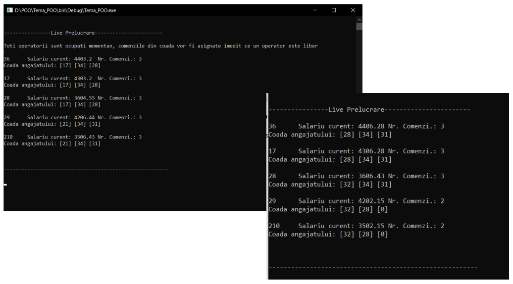
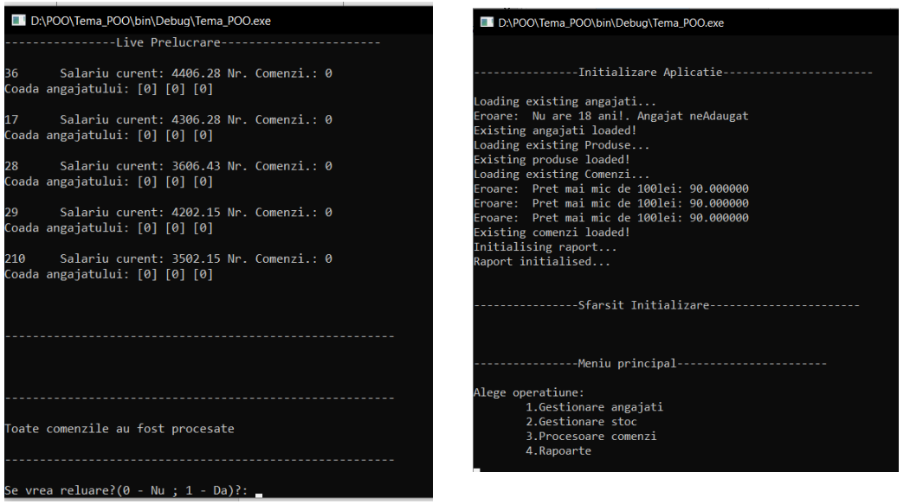
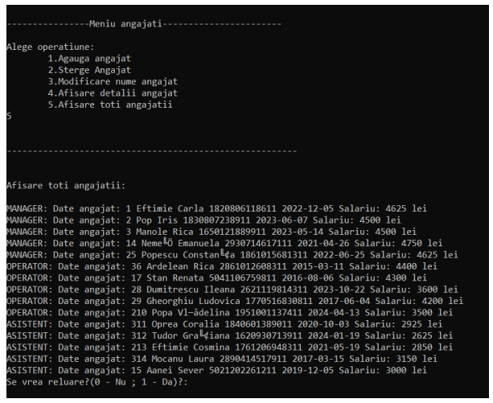

# 🎸 ROCK the SHOP  

## Descriere  
"ROCK the SHOP" este un sistem pentru administrarea automată a unui magazin de produse muzicale. Proiectul implementează un model de gestionare a angajaților, produselor și comenzilor, utilizând tehnici moderne de programare orientată pe obiecte în **C++**.

## Funcționalități  
- Administrarea angajaților (Manageri, Operatori, Asistenți)  
- Gestionarea produselor (Vestimentare, Discuri, Discuri Vintage)  
- Procesarea comenzilor în mod eficient folosind cozi (queue)  
- Calcularea salariilor angajaților, incluzând bonusuri și comisioane  
- Stocarea și gestionarea datelor folosind **liste C++ (list)** și **queue**  
- Interfață bazată pe consolă cu meniuri interactive  
- Simulare în timp real a procesării comenzilor folosind **sleep()** și **clear()**  

## Screenshot-uri rin rularea programului

## Structura Proiectului  
- **Angajati/** → Clasele pentru angajați și gestionarea acestora  
- **Produse/** → Clasele pentru produse și funcțiile asociate  
- **Comenzi/** → Gestionarea comenzilor și rapoarte  
- **Date/** → Fișiere CSV pentru încărcarea datelor  
- **Main.cpp** → Punctul de intrare al programului  

##  Tehnologii Utilizate  
- **C++ (Modern)** → Utilizare de **std::string**, **list**, **vector**, **queue**  
- **Polimorfism și OOP** → Moștenire pentru diferite tipuri de angajați și produse  
- **Try-Catch** → Gestionarea excepțiilor la citirea și procesarea datelor  
- **Lambda Functions** → Folosite pentru sortare și filtrare  

## Fluxul Procesării Comenzilor  
1. Operatorii sunt extrași și organizați într-un vector.  
2. Se scanează operatorii disponibili, iar comenzile sunt distribuite echitabil.  
3. Dacă toți operatorii sunt ocupați, programul **așteaptă** și reia procesul.  
4. La fiecare secundă, comenzile sunt procesate și dețin un timp de finalizare.  
5. Odată ce un operator termină o comandă, preia automat următoarea din coadă.  

## Observatii si Modificari
- In procesarea comenzilor din queue si in afisarea procesului un **priority queue** ar fi fost mai intuitiv si eficient
- Folosirea unei clase **Magazin** ar fi usurat administrarea tuturor proceselor iar lizibilitatea programului ar fi fost imbunatatita
- Folosirea functiilor virtuale poate fi administrata mai bine